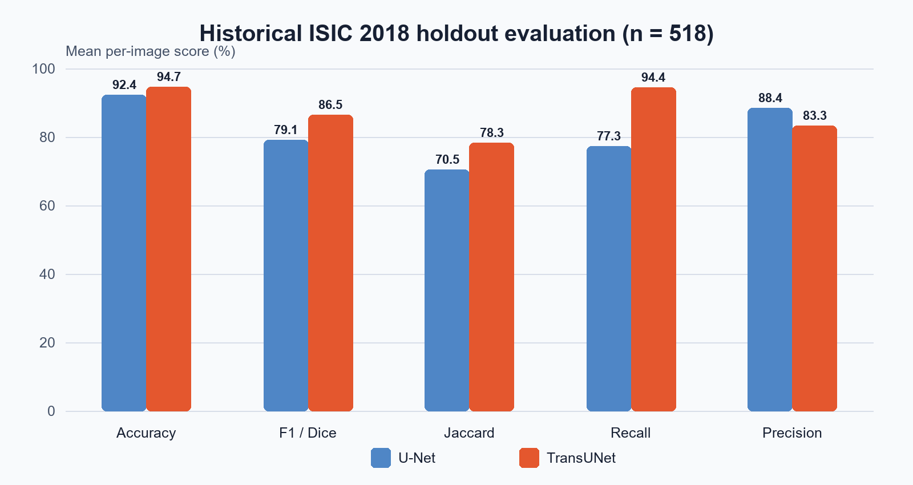

# Skin Lesion Segmentation with U-Net and TransUNet

[](https://www.python.org/)
[](https://www.tensorflow.org/)
[](LICENSE)

A TensorFlow comparison of a convolutional U-Net baseline and a hybrid
CNN-Transformer U-Net for binary skin-lesion segmentation on ISIC 2018. The
hybrid model combines a pretrained ResNetV2 feature extractor, global
self-attention, skip connections, and a convolutional decoder.

> **Headline result:** on the archived 518-image holdout evaluation, mean recall
> increased from **77.29% (U-Net)** to **94.42% (TransUNet)**, a gain of
> **17.13 percentage points**. These are historical experiment results recovered
> from the original per-image evaluation CSVs; they have not been rerun during
> this repository cleanup because the original training images and checkpoints
> are not distributed here.



## Why this project is relevant

- Implements both a strong CNN baseline and a hybrid vision-transformer model.
- Preserves spatial detail through multi-scale encoder-to-decoder skip features.
- Uses global self-attention to model long-range relationships in image regions.
- Provides paired data loading, deterministic 60/20/20 splits, augmentation,
  evaluation, and reproducible result summaries.
- Keeps the repository lightweight: no patient images, large weights, logs, or
  personal files are committed.

## Results

Metrics are macro averages of per-image binary segmentation scores from the
archived holdout set (`n = 518`). The full sanitized records are in
[`results/historical`](results/historical).

| Model | Accuracy | F1 / Dice | Jaccard / IoU | Recall | Precision |
|---|---:|---:|---:|---:|---:|
| U-Net | 92.41% | 79.11% | 70.52% | 77.29% | 88.42% |
| TransUNet | **94.68%** | **86.51%** | **78.28%** | **94.42%** | 83.31% |
| Change | +2.27 pp | +7.40 pp | +7.76 pp | **+17.13 pp** | -5.10 pp |

The recall improvement comes with a precision trade-off, which is important in
medical segmentation: TransUNet missed fewer lesion pixels but produced more
false-positive pixels than U-Net. See [`REPORT.md`](REPORT.md) for methodology,
limitations, and interpretation.

### Architecture complexity and CPU inference

The full 256 x 256 models were also benchmarked with batch size one and a
synthetic input tensor. No dataset or trained weights are needed for this
architecture-only comparison.

| Model | Parameters | FP32 parameter memory | Median latency | p95 latency | Throughput |
|---|---:|---:|---:|---:|---:|
| U-Net | 31.05M | 118.44 MiB | 750.2 ms | 786.5 ms | 1.33 FPS |
| TransUNet | 100.89M | 384.85 MiB | 1,149.1 ms | 1,208.2 ms | 0.87 FPS |

On this CPU configuration, TransUNet used about 3.25x the FP32 parameter memory
and had 1.53x the median latency of U-Net. This complements the historical
quality results by making the accuracy-efficiency trade-off visible.

The benchmark used TensorFlow 2.15.1, Python 3.11.16, Windows, four TensorFlow
intra-op threads, one inter-op thread, five warm-up passes, and 20 measured
passes on a machine with 16 logical CPUs. Results are development-machine
measurements, not mobile or production-performance claims. Full precision and
environment metadata are stored in
[`results/benchmark/cpu_architecture_benchmark.json`](results/benchmark/cpu_architecture_benchmark.json).

## Architecture

```text
256 x 256 RGB image
        |
  ResNet50V2 encoder ---- multi-scale skip features ------------------+
        |                                                             |
 token projection + learned positional embeddings                     |
        |                                                             |
 12 x Transformer encoder blocks                                      |
        |                                                             |
 reshape tokens to feature map                                        |
        |                                                             |
 convolutional decoder <----------------------------------------------+
        |
 256 x 256 sigmoid mask
```

The default configuration mirrors the archived experiment: 12 attention
blocks, 12 heads, 768-dimensional tokens, and a `[256, 128, 64, 16]` decoder.
The implementation is parameterized so smaller variants can be used for smoke
tests and edge-oriented experiments.

## Quick start

TensorFlow 2.15 supports Python 3.9-3.11. A CPU environment is enough for smoke
tests; training the full TransUNet is substantially faster on a CUDA-capable
GPU.

```bash
python -m venv .venv
# Windows: .venv\Scripts\activate
# Linux/macOS: source .venv/bin/activate
python -m pip install --upgrade pip
python -m pip install -e ".[dev]"
```

Run the tests and build both models:

```bash
pytest
python scripts/smoke_test_models.py
```

Reproduce the data-free architecture benchmark:

```bash
python scripts/benchmark_models.py --warmup 5 --iterations 20 --threads 4
```

Create a small, fully synthetic dataset for pipeline testing:

```bash
python scripts/generate_synthetic_data.py --output data/synthetic --samples 24
python scripts/train.py --model unet --data-dir data/synthetic --epochs 1
```

Synthetic images contain procedural ellipses and noise. They are useful only
for verifying code paths and must not be reported as medical-model evidence.

## Using ISIC 2018

Download the Task 1 training input and ground-truth archives from the
[official ISIC 2018 challenge page](https://challenge.isic-archive.com/landing/2018/45/),
then arrange them as follows:

```text
data/isic2018/
|-- ISIC2018_Task1-2_Training_Input/
|   `-- ISIC_XXXXXXX.jpg
`-- ISIC2018_Task1_Training_GroundTruth/
    `-- ISIC_XXXXXXX_segmentation.png
```

Train and evaluate:

```bash
python scripts/train.py --model unet --data-dir data/isic2018 --epochs 50
python scripts/train.py --model transunet --data-dir data/isic2018 --epochs 50
python scripts/evaluate.py --model unet --data-dir data/isic2018 \
  --weights artifacts/unet/best.keras
python scripts/evaluate.py --model transunet --data-dir data/isic2018 \
  --weights artifacts/transunet/best.keras
```

The loader pairs images and masks by ISIC identifier before splitting them,
preventing the silent image-mask misalignment that can occur when two sorted
lists are split independently.

## Repository layout

```text
src/skin_lesion_segmentation/  reusable data, metric, and model code
scripts/                       train, evaluate, smoke-test, and demo utilities
tests/                         data-pairing and historical-result regression tests
results/historical/            sanitized per-image metrics and summary
results/benchmark/             data-free complexity and CPU latency benchmark
docs/assets/                   compact figures retained from the archived run
data/README.md                 dataset layout and provenance notes
```

## Reproducibility and scope

- Random seeds and split ratios are explicit.
- Nearest-neighbor interpolation is used for binary masks.
- Checkpoints, raw datasets, TensorBoard logs, and predictions are ignored.
- The historical run used five epochs; this is too short for a publication-grade
  comparison and the archived split cannot be independently reconstructed
  without the original inputs.
- The project is a research/portfolio implementation, not a diagnostic system.

## References

1. Chen et al., [*TransUNet: Transformers Make Strong Encoders for Medical Image Segmentation*](https://arxiv.org/abs/2102.04306), 2021.
2. Ronneberger et al., [*U-Net: Convolutional Networks for Biomedical Image Segmentation*](https://arxiv.org/abs/1505.04597), 2015.
3. Codella et al., [*Skin Lesion Analysis Toward Melanoma Detection 2018*](https://arxiv.org/abs/1902.03368), 2019.
4. TensorFlow implementation adapted from [awsaf49/TransUNet-tf](https://github.com/awsaf49/TransUNet-tf); see [`THIRD_PARTY_NOTICES.md`](THIRD_PARTY_NOTICES.md).
